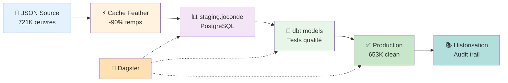

# 🎨 Pipeline ETL Modern Data Stack - Base Joconde

> Pipeline ETL automatisé traitant **721,629 œuvres d'art** du catalogue national des musées français avec Dagster, dbt et PostgreSQL

[](https://www.python.org/)
[](https://www.postgresql.org/)
[](https://www.getdbt.com/)
[](https://dagster.io/)
[](LICENSE)

## 📊 Résultats en un coup d'œil

| Métrique | Valeur | Impact |
|----------|--------|--------|
| **Enregistrements traités** | 721,629 | 100% du catalogue |
| **Enregistrements production** | 653,686 | 90.6% qualité |
| **Optimisation temps** | -90% | Via cache Feather + Polars |
| **Compression données** | 10x | 450 MB → 45 MB |
| **Tests qualité** | 2/2 pass | Validation automatique dbt |
| **Documentation** | Auto-générée | dbt docs + Dagster UI |

## 🎯 Objectif du projet

Démonstration d'un pipeline ETL moderne appliquant les **meilleures pratiques de data engineering** :

✅ Architecture staging-production PostgreSQL  
✅ Orchestration Dagster avec monitoring temps réel  
✅ Transformations dbt avec tests qualité  
✅ Optimisation performances (batch processing, cache)  
✅ Documentation automatique  
✅ Infrastructure as Code (Docker)

## 🏗️ Architecture


### Pipeline détaillé
```
1. EXTRACTION
   └─ JSON 450 MB (Base Joconde)
      └─ Cache Feather (optimisation I/O)
         └─ Polars DataFrame (10x plus rapide que Pandas)

2. STAGING (PostgreSQL)
   └─ staging.joconde (721,629 lignes brutes)
      └─ Schéma flexible, données non transformées
         └─ Index sur colonnes clés

3. TRANSFORMATION (dbt)
   └─ Nettoyage : COALESCE, TRIM, validation
      └─ Tests : NOT NULL, formats, cohérence
         └─ Documentation auto-générée

4. PRODUCTION (PostgreSQL)
   └─ joconde_oeuvre (653,686 lignes validées)
      └─ Tables temporelles (historisation)
         └─ Vues analytiques précalculées

5. ORCHESTRATION (Dagster)
   └─ Assets avec dépendances
      └─ Monitoring temps réel
         └─ Lineage automatique
```

## 🛠️ Stack Technique

### Core Technologies

| Couche | Technologies | Rôle |
|--------|-------------|------|
| **Orchestration** | Dagster, Prefect | Workflow, monitoring, scheduling |
| **Transformation** | dbt Core + dbt-postgres | SQL transformations, tests, docs |
| **Processing** | Python 3.13, Polars, SQLAlchemy | Data manipulation haute performance |
| **Storage** | PostgreSQL 13 (Docker) | Data warehouse |
| **Infra** | Docker, Git, pgAdmin | Environnement reproductible |

### Librairies Python clés
```python
polars      # DataFrames 10x plus rapides que Pandas
dagster     # Modern data orchestration
dbt-core    # SQL transformations with testing
sqlalchemy  # Database ORM & migrations
psycopg2    # PostgreSQL driver
```

## 🚀 Quick Start

### Prérequis
```bash
# Vérifier les versions
python --version    # 3.13+
docker --version    # 20.10+
psql --version      # 13+
```

### Installation (5 minutes)
```bash
# 1. Cloner le repo
git clone https://github.com/bipanda93/ETL-pipeline-Joconde.git
cd ETL-pipeline-Joconde

# 2. Créer l'environnement virtuel
python -m venv .venv
source .venv/bin/activate  # macOS/Linux
# .venv\Scripts\activate   # Windows

# 3. Installer les dépendances
pip install -r requirements.txt

# 4. Copier la config exemple
cp config.example.yaml config.yaml
# Éditer config.yaml avec vos chemins

# 5. Démarrer PostgreSQL
docker-compose up -d

# 6. Créer les schémas et tables
docker exec -i postgres-1 psql -U airflow -d joconde_staging < sql/create_production.sql
```

### Télécharger les données (optionnel)
```bash
# Télécharger la Base Joconde (450 MB)
wget https://data.culture.gouv.fr/explore/dataset/base-joconde-extrait/download/?format=json -O base-joconde-extrait.json

# Ou utiliser les données de test fournies
# (échantillon de 10K lignes dans data/sample.json)
```

### Exécution

#### Option 1 : Avec Dagster (Recommandé)
```bash
# Lancer Dagster UI
dagster dev -f etl_dagster/definitions.py -d etl_dagster

# Ouvrir http://localhost:3000
# Cliquer sur "Materialize all" pour lancer le pipeline
```


#### Option 2 : Avec Prefect
```bash
python 04.01.prefect.py
```

#### Option 3 : Script standalone
```bash
python staging-code.py
```

#### Option 4 : dbt uniquement
```bash
cd dbt/joconde
dbt run      # Exécuter les transformations
dbt test     # Lancer les tests qualité
dbt docs generate && dbt docs serve  # Documentation sur http://localhost:8080
```

## 📂 Structure du projet
```
ETL-pipeline-Joconde/
│
├── 📄 README.md                    # Ce fichier
├── 📄 requirements.txt             # Dépendances Python
├── 📄 docker-compose.yml           # Infrastructure PostgreSQL
├── 📄 config.example.yaml          # Configuration exemple
├── 📄 .gitignore                   # Fichiers à exclure
│
├── 📁 sql/                         # Scripts SQL
│   ├── create_production.sql      # Création tables production
│   ├── importation.sql            # Script de chargement
│   ├── table-temporelle.sql       # Tables avec historisation
│   └── analyses.sql               # Requêtes d'analyse
│
├── 📁 etl_dagster/                # Pipeline Dagster
│   ├── definitions.py             # Définitions des assets
│   ├── utils.py                   # Fonctions utilitaires
│   └── assets/
│       ├── extract.py             # Extraction JSON → DataFrame
│       ├── transform.py           # Transformations Polars
│       ├── load.py                # Chargement PostgreSQL
│       └── dbt_assets.py          # Intégration dbt
│
├── 📁 dbt/joconde/                # Projet dbt
│   ├── dbt_project.yml            # Configuration dbt
│   ├── profiles.yml               # Connexion DB (dans ~/.dbt/)
│   ├── models/
│   │   ├── joconde_cleaned.sql    # Modèle de nettoyage
│   │   └── schema.yml             # Tests & documentation
│   └── target/
│       └── manifest.json          # Métadonnées compilées
│
├── 📁 documentation/              # Docs additionnelles
│   ├── architecture.md
│   ├── deployment.md
│   └── troubleshooting.md
│
└── 📁 data/                       # Données (non versionnées)
    └── sample.json                # Échantillon 10K lignes
```

## 🧪 Tests & Validation

### Tests dbt (qualité des données)
```bash
cd dbt/joconde
dbt test
```

**Tests implémentés :**
- ✅ `date_creation NOT NULL` : Vérification présence date
- ✅ `region NOT NULL` : Vérification présence région
- ✅ Format date valide (custom test)

### Validation manuelle PostgreSQL
```bash
# Compter les enregistrements
docker exec -it postgres-1 psql -U airflow -d joconde_staging \
  -c "SELECT COUNT(*) FROM joconde_oeuvre;"

# Vérifier la qualité
docker exec -it postgres-1 psql -U airflow -d joconde_staging \
  -c "SELECT 
        COUNT(*) as total,
        COUNT(CASE WHEN auteur IS NOT NULL THEN 1 END) as avec_auteur,
        ROUND(AVG(LENGTH(description))::numeric, 2) as longueur_moy_description
      FROM joconde_oeuvre;"
```

## 📊 Analyses disponibles

### Via SQL
```sql
-- Top 10 régions
SELECT region, COUNT(*) as nb_oeuvres
FROM joconde_oeuvre
GROUP BY region
ORDER BY nb_oeuvres DESC
LIMIT 10;

-- Distribution par siècle
SELECT * FROM v_oeuvres_par_siecle;

-- Top auteurs par région
SELECT * FROM v_top_auteurs_region WHERE region = 'Île-de-France';
```

### Via Dagster UI

1. Ouvrir http://localhost:3000
2. Onglet "Assets" → Visualiser le lineage complet
3. Onglet "Runs" → Historique d'exécution
4. Metrics & monitoring temps réel

### Via dbt Docs
```bash
cd dbt/joconde
dbt docs serve
# Ouvrir http://localhost:8080
```

Documentation interactive avec :
- 📊 Diagramme de lignage (DAG)
- 📝 Description de chaque colonne
- ✅ Résultats des tests
- 📈 Statistiques des tables

## 🎓 Compétences démontrées

### Data Engineering

✅ **Pipeline ETL/ELT moderne** : Architecture complète extraction-transformation-chargement  
✅ **Orchestration** : Dagster pour workflows complexes avec dépendances  
✅ **Data Quality** : Tests automatisés avec dbt (NOT NULL, formats, cohérence)  
✅ **Performance** : Optimisation 90% via cache, batch processing, indexation  
✅ **Data Modeling** : Schémas staging/production, vues, tables temporelles

### Software Engineering

✅ **Clean Code** : Architecture modulaire, séparation des responsabilités  
✅ **Documentation** : README complet, docstrings, dbt docs auto-générées  
✅ **Version Control** : Git avec commits sémantiques, .gitignore propre  
✅ **Testing** : Tests qualité données automatisés

### DevOps

✅ **Infrastructure as Code** : Docker Compose, configuration YAML  
✅ **Reproductibilité** : Environnement facilement déployable  
✅ **Monitoring** : Dagster UI pour observabilité

## 🔄 Évolutions futures

- [ ] **CI/CD** : GitHub Actions pour tests automatiques
- [ ] **Alerting** : Notifications Slack en cas d'échec
- [ ] **Incremental loads** : Chargement incrémental au lieu de TRUNCATE/INSERT
- [ ] **Data validation** : Great Expectations pour validation avancée
- [ ] **Dashboard** : Metabase ou Superset pour visualisations
- [ ] **API REST** : FastAPI pour accès programmatique aux données
- [ ] **Cloud deployment** : AWS (S3 + Glue + Athena) ou Snowflake

## 📚 Ressources

### Documentation officielle

- [Dagster Docs](https://docs.dagster.io/)
- [dbt Docs](https://docs.getdbt.com/)
- [PostgreSQL Docs](https://www.postgresql.org/docs/)
- [Polars Guide](https://pola-rs.github.io/polars-book/)

### Source des données

- [Base Joconde (data.gouv.fr)](https://data.culture.gouv.fr/explore/dataset/base-joconde-extrait/)
- Licence : Licence Ouverte / Open License (Etalab)

## 🐛 Troubleshooting

### Erreur : "port 5434 already in use"
```bash
# Arrêter PostgreSQL existant
docker-compose down
# Ou changer le port dans docker-compose.yml
```

### Erreur : "dbt command not found"
```bash
# Vérifier que vous êtes dans le venv
source .venv/bin/activate
# Réinstaller dbt
pip install dbt-core dbt-postgres
```

### Erreur : "Permission denied PostgreSQL"
```bash
# Se connecter avec l'utilisateur admin
docker exec -it postgres-1 psql -U airflow -d joconde_staging
# Donner les permissions
GRANT ALL PRIVILEGES ON SCHEMA staging TO joconde_import;
```

## 📄 Licence

MIT License - Voir [LICENSE](LICENSE)

## 👤 Auteur

**Franck Bipanda**  
*Data Engineer | Master Data Engineer @ F2I Institut*

[](https://www.linkedin.com/in/franck-bipanda-13392372)
[](https://www.datascienceportfol.io/bipandaf)
[](https://github.com/bipanda93)
[](mailto:bipanda.franck@icloud.com)

---

<div align="center">

### 💼 Recherche stage Data Engineer (6 mois)

**Compétences :** Python • SQL • Airflow • Dagster • dbt • PostgreSQL • NoSQL • Docker  
**Disponibilité :** Immédiate  
**Localisation :** Île-de-France

</div>

---

<div align="center">

⭐ Si ce projet vous a aidé, n'hésitez pas à lui donner une étoile !

Made with ❤️ and ☕ by Franck Bipanda

</div>
